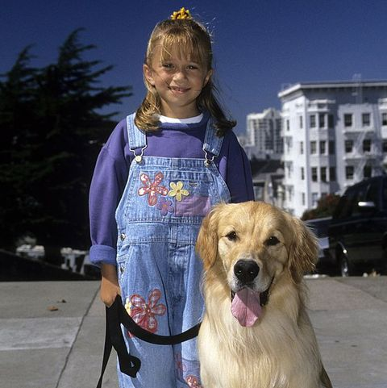
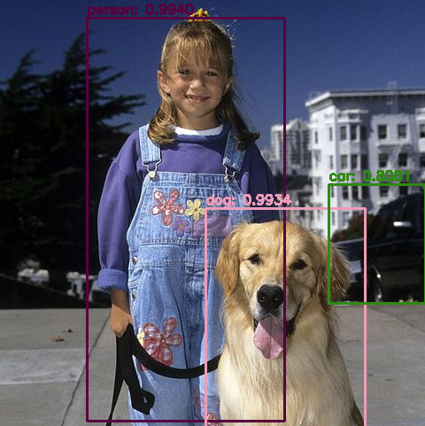

# YOLO-v3

- This is simple implementation of YOLO v3 using python open-cv.
- It simply detects 40 classes in video.
- You can also send image and get output for that you have to change few lines in yolo.py

# Example 
- Input Image 

- Output of above image after applied yolo

# Reference
- https://towardsdatascience.com/yolo-v3-explained-ff5b850390f
